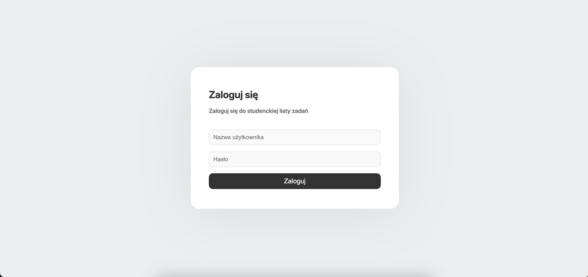
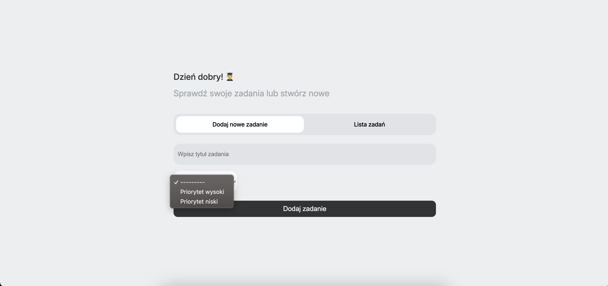
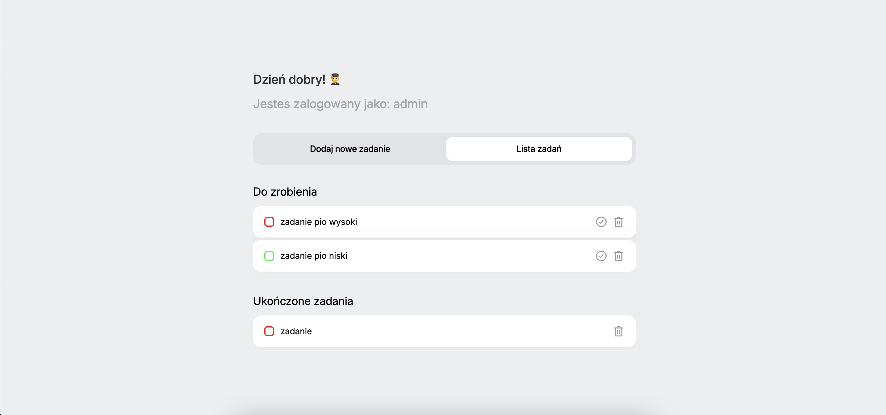

# Todo App w Django

Prosta i estetyczna aplikacja do zarzadzania zadaniami w Django stworzona dla studentów. Dzięki minimalistycznemu designowi szybko zapisuję i organizuję swoje obowiązki, a intuicyjny interfejs sprawia, że planowanie jest przyjemne

## Zrzuty ekranu

### Strona logowania (http://127.0.0.1:8000/login/)


### Strona dodania zadania (http://127.0.0.1:8000/create/)


### Strona listy zadan (http://127.0.0.1:8000/)


## Instalacja

1. Sklonuj repozytorium:
   ```bash
   git clone https://github.com/domgola77/todo_app.git
   cd todo_app

2. Stwórz wirtualne środowisko i zainstaluj zależności:

    python -m venv venv
   
    source venv/bin/activate  # Linux/macOS
   
    venv\Scripts\activate     # Windows
   
    pip install -r requirements.txt

4. Wykonaj migracje bazy danych:

    python manage.py migrate

5. Utwórz użytkownika administracyjnego: Uruchom skrypt initialize_users.py, aby utworzyć użytkownika admin z hasłem admin123: 

    python manage.py shell < initialize_users.py

6. Uruchamianie serwera: 

    python manage.py runserver

Aplikacja będzie dostępna pod adresem: http://127.0.0.1:8000/.
